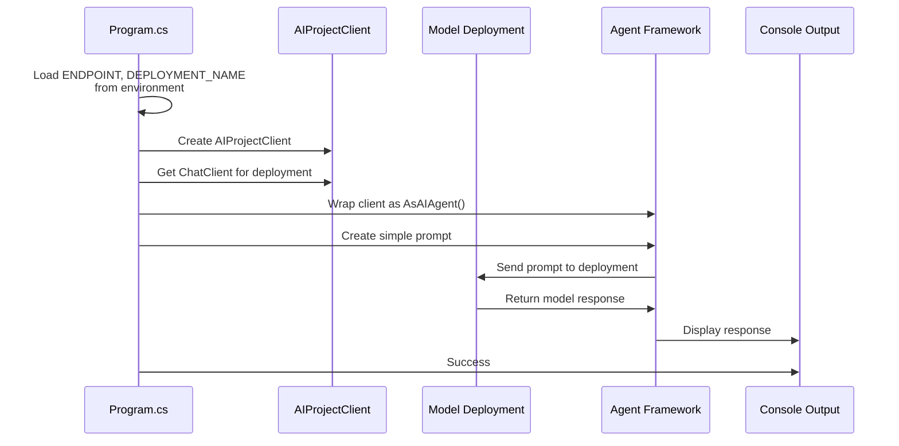
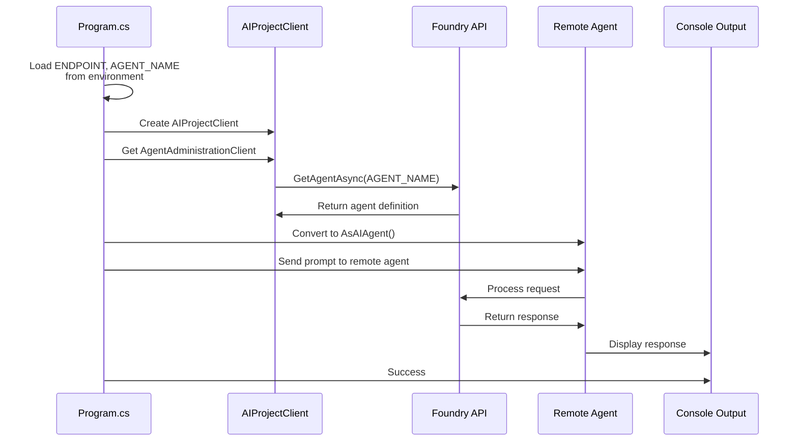
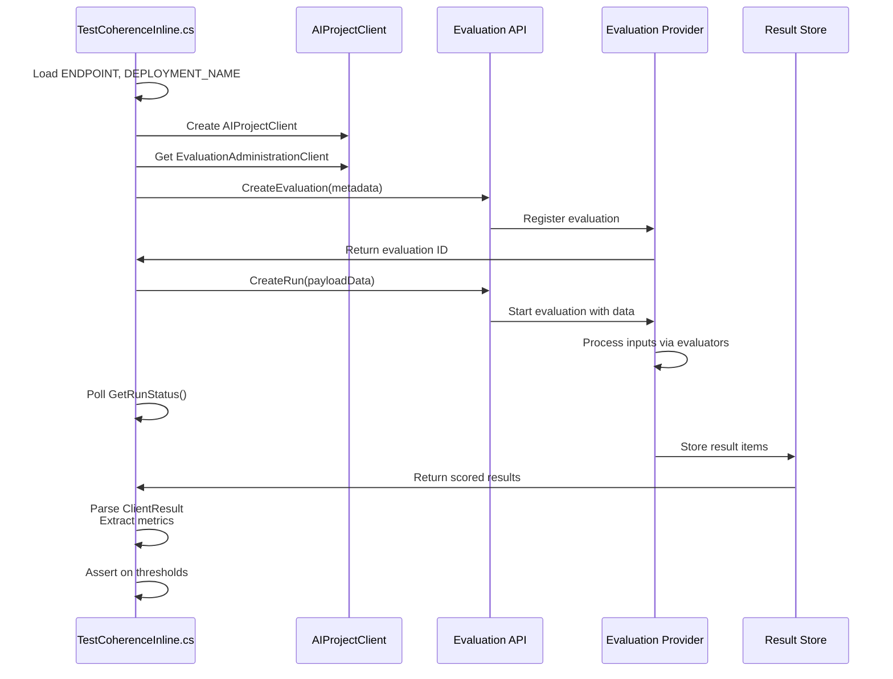
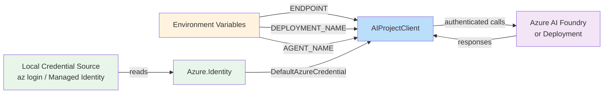
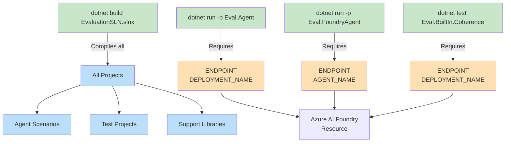
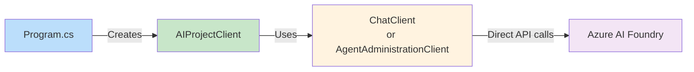
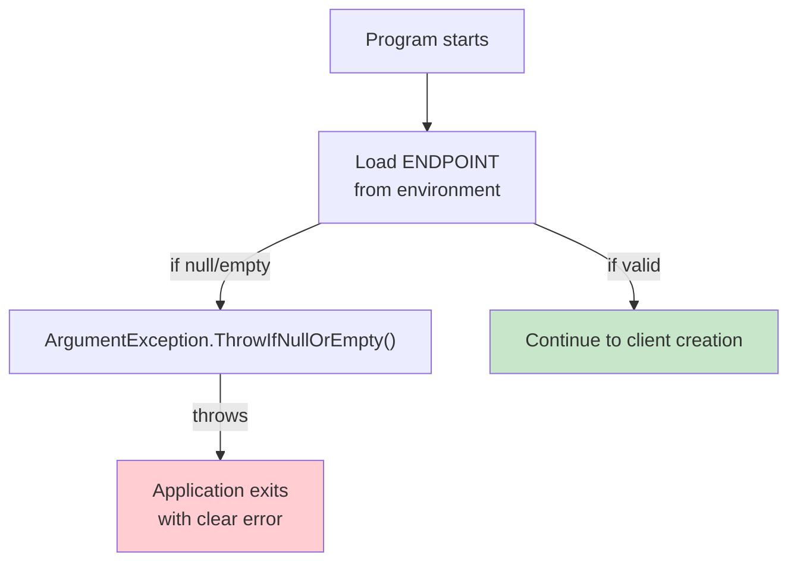
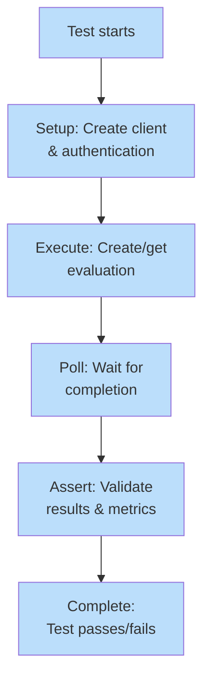

# Solution Architecture & Project Structure

This document provides a visual breakdown of the solution's project layout, dependencies, and data flow.

---

## Project Dependency Graph

```mermaid
graph TB
    subgraph Core["Core Libraries"]
        TB["Eval.Tests.Base<br/>(Test Infrastructure)"]
    end

    subgraph Evaluators["Built-in Evaluators"]
        BEC["Eval.BuiltIn.Coherence<br/>(Coherence Tests)"]
        BVD["Eval.BuiltIn.ViolenceDetection<br/>(Violence Detection Tests)"]
        BBLU["Eval.BuiltIn.BleuScoreTests<br/>(BLEU Score Tests)"]
        BAE["Eval.BuiltIn.AgentEvaluation<br/>(Agent Eval Tests)"]
        BEC2["Eval.BuiltIn.EvaluatorsCatalog<br/>(Catalog Exploration)"]
    end

    subgraph Scenarios["Agent Scenarios"]
        EA["Eval.Agent<br/>(Agent Framework)"]
        EFA["Eval.FoundryAgent<br/>(Foundry Agent)"]
        EAAE["Eval.Agent.AIAssistedEvaluation<br/>(AI-Assisted Tests)"]
    end

    subgraph External["External Dependencies"]
        MEE["Microsoft.Extensions.AI<br/>Evaluation*"]
        AIP["Azure.AI.Projects<br/>SDK"]
        AGENTS["Microsoft.Agents*"]
        IDENTITY["Azure.Identity"]
    end

    BEC -->|depends| TB
    BVD -->|depends| TB
    BBLU -->|depends| TB
    BAE -->|depends| TB
    EAAE -->|depends| TB

    BEC -->|uses| MEE
    BVD -->|uses| MEE
    BBLU -->|uses| MEE
    BAE -->|uses| MEE

    EA -->|uses| MEE
    EA -->|uses| AGENTS
    
    EFA -->|uses| MEE
    EFA -->|uses| AGENTS
    EFA -->|uses| AIP

    EAAE -->|uses| MEE

    EA -->|uses| AIP
    EFA -->|uses| AIP
    
    TB -->|uses| AIP
    
    EA -->|uses| IDENTITY
    EFA -->|uses| IDENTITY

    classDef scenario fill:#e1f5ff
    classDef evaluator fill:#f3e5f5
    classDef core fill:#fff3e0
    classDef external fill:#e8f5e9
    
    class EA,EFA,EAAE scenario
    class BEC,BVD,BBLU,BAE,BEC2 evaluator
    class TB core
    class MEE,AIP,AGENTS,IDENTITY external

    note["* See official packages:<br/>Microsoft.Extensions.AI.Evaluation*<br/>Microsoft.Agents.AI.* libraries"]
    style note fill:#fffde7
```

---

## Solution Folder Structure

```mermaid
graph TB
    Root["azure-demos-evaluation-options"]
    
    SRC["src/"]
    SLN["EvaluationSLN/"]
    
    PROJ1["Eval.Agent<br/>(Agent Framework Scenario)"]
    PROJ2["Eval.FoundryAgent<br/>(Foundry Agent Scenario)"]
    PROJ3["Eval.Tests.Base<br/>(Shared Test Base)"]
    PROJ4["Eval.BuiltIn.Coherence<br/>(Coherence Evaluation)"]
    PROJ5["Eval.BuiltIn.ViolenceDetection<br/>(Violence Detection)"]
    PROJ6["Eval.BuiltIn.BleuScoreTests<br/>(BLEU Scoring)"]
    PROJ7["Eval.BuiltIn.AgentEvaluation<br/>(Agent Eval Tests)"]
    PROJ8["Eval.BuiltIn.EvaluatorsCatalog<br/>(Catalog Exploration)"]
    PROJ9["Eval.Agent.AIAssistedEvaluation<br/>(AI-Assisted Tests)"]

    DOCS["docs/"]
    SCRIPTS["scripts/"]
    TESTS["tests/"]
    DATA["data/"]

    Root --> SRC
    Root --> DOCS
    Root --> SCRIPTS
    Root --> TESTS
    Root --> DATA
    Root --> README["README.md"]
    Root --> LICENSE["LICENSE"]

    SRC --> SLN
    
    SLN --> PROJ1
    SLN --> PROJ2
    SLN --> PROJ3
    SLN --> PROJ4
    SLN --> PROJ5
    SLN --> PROJ6
    SLN --> PROJ7
    SLN --> PROJ8
    SLN --> PROJ9
    SLN --> SLNX["EvaluationSLN.slnx"]

    DOCS --> DOC1["overview.md<br/>(This Document)"]
    DOCS --> DOC2["agent-framework.md"]
    DOCS --> DOC3["foundry-sdk.md"]
    DOCS --> DOC4["evaluation-concepts.md"]
    DOCS --> DOC5["architecture.md<br/>(This Document)"]

    classDef project fill:#bbdefb
    classDef doc fill:#c8e6c9
    classDef root fill:#ffe0b2
    
    class PROJ1,PROJ2,PROJ3,PROJ4,PROJ5,PROJ6,PROJ7,PROJ8,PROJ9 project
    class DOC1,DOC2,DOC3,DOC4,DOC5 doc
    class Root root
```

---

## Agent Scenario Flow

### Eval.Agent (Agent Framework Scenario)

---

## Foundry Agent Scenario Flow

### Eval.FoundryAgent (Foundry SDK Scenario)

---

## Evaluation Test Flow

### Built-in Evaluators (Coherence Example)

---

## Project Roles & Responsibilities

| Project | Type | Purpose | Role |
|---------|------|---------|------|
| **Eval.Agent** | Console App | Demonstrate Agent Framework integration with evaluations | Scenario showcase |
| **Eval.FoundryAgent** | Console App | Demonstrate Foundry SDK agent evaluation | Scenario showcase |
| **Eval.Tests.Base** | Library | Shared test infrastructure (authentication, helpers) | Support library |
| **Eval.BuiltIn.Coherence** | Test Project | Live integration test for coherence evaluation | Feature demo |
| **Eval.BuiltIn.ViolenceDetection** | Test Project | Live integration test for violence detection | Feature demo |
| **Eval.BuiltIn.BleuScoreTests** | Test Project | Live integration test for BLEU scoring | Feature demo |
| **Eval.BuiltIn.AgentEvaluation** | Test Project | Live integration test for agent evaluation | Feature demo |
| **Eval.BuiltIn.EvaluatorsCatalog** | Test Project | Explore available evaluators and their capabilities | Discovery tool |
| **Eval.Agent.AIAssistedEvaluation** | Test Project | AI-assisted evaluation test scenarios | Advanced demo |

---

## Authentication & Environment Flow

---

## Build & Test Command Map

---

## Key Patterns Used

### 1. Direct Azure Service Access

### 2. Fail-Fast Environment Validation

### 3. Live Integration Test Pattern

---

## Extension Points

Future projects should follow these patterns:

1. **New Console App Scenario**: Create `Eval.{Scenario}` folder with `Program.cs` using top-level statements
2. **New Evaluation Test**: Create `Eval.BuiltIn.{Feature}` with test class depending on `Eval.Tests.Base`
3. **Shared Helpers**: Add to `Eval.Tests.Base` to avoid duplication
4. **Environment Validation**: Use `ArgumentException.ThrowIfNullOrEmpty()` near the top of `Program.cs`
5. **Console Output**: Use `Spectre.Console` (`AnsiConsole.MarkupLine`, etc.) for consistent UX

---

## Related Documentation

- [Project Overview](overview.md) — High-level architecture and evaluation flow
- [Agent Framework Guide](agent-framework.md) — Details on Agent Framework scenarios
- [Foundry SDK Guide](foundry-sdk.md) — Details on Foundry SDK scenarios
- [Evaluation Concepts](evaluation-concepts.md) — Explanation of evaluation principles
- [AGENTS.md](../src/EvaluationSLN/AGENTS.md) — Workspace map and verified commands
