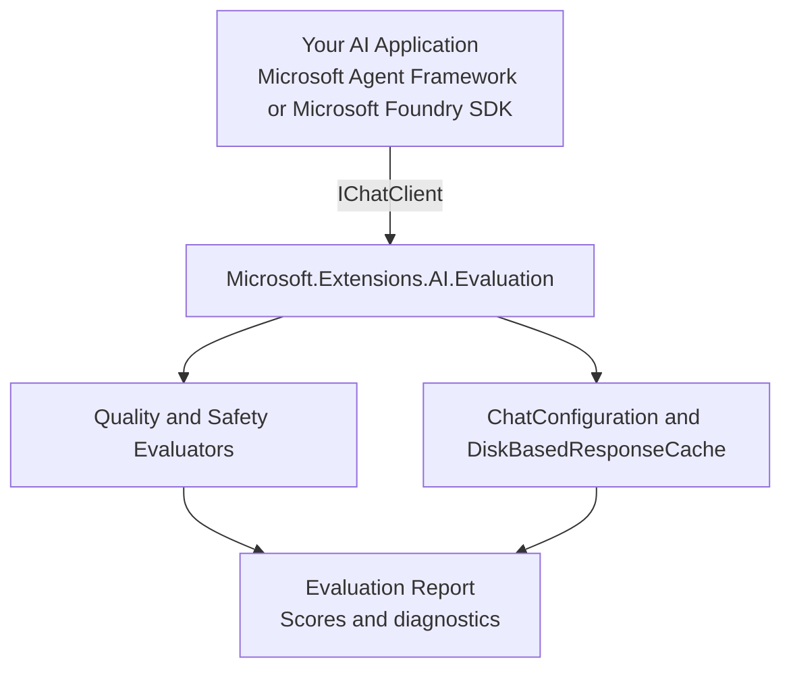

# Project Overview

## Purpose

This repository demonstrates how to use the official [Microsoft.Extensions.AI.Evaluation](https://learn.microsoft.com/en-us/dotnet/ai/evaluation/libraries) libraries to evaluate AI applications built on the Microsoft AI ecosystem.

The goal is to make AI evaluation approachable and repeatable by showing two concrete implementation paths:

1. **Microsoft Agent Framework** — evaluating agent-based workflows
2. **Microsoft Foundry SDK** — evaluating models and prompts through Azure AI Foundry

## Architecture

## Evaluation Flow

1. **Define a scenario** — a set of inputs (messages, context) to test
2. **Run the AI** — send inputs through an `IChatClient`
3. **Evaluate responses** — apply one or more evaluators
4. **Report results** — persist and review scores

## Key Libraries

| NuGet Package | Version | Description |
|---|---|---|
| `Microsoft.Extensions.AI.Evaluation` | latest | Core evaluation abstractions |
| `Microsoft.Extensions.AI.Evaluation.Quality` | latest | Quality evaluators |
| `Microsoft.Extensions.AI.Evaluation.Safety` | latest | Safety evaluators |
| `Microsoft.Extensions.AI.Evaluation.Reporting` | latest | Result storage and reporting |
| `Microsoft.Agents.AI.Foundry` | latest | Microsoft Agent Framework integration with Foundry |
| `Azure.AI.Projects` | latest | Microsoft Foundry SDK client APIs |

## Official References

- [Microsoft.Extensions.AI.Evaluation documentation](https://learn.microsoft.com/en-us/dotnet/ai/evaluation/libraries)
- [AI Evaluation API samples on GitHub](https://github.com/dotnet/ai-samples/tree/main/src/microsoft-extensions-ai-evaluation/api)
- [Azure AI Foundry Agents](https://learn.microsoft.com/en-us/azure/ai-foundry/agents/)
- [Azure AI Foundry](https://learn.microsoft.com/en-us/azure/ai-foundry/)
